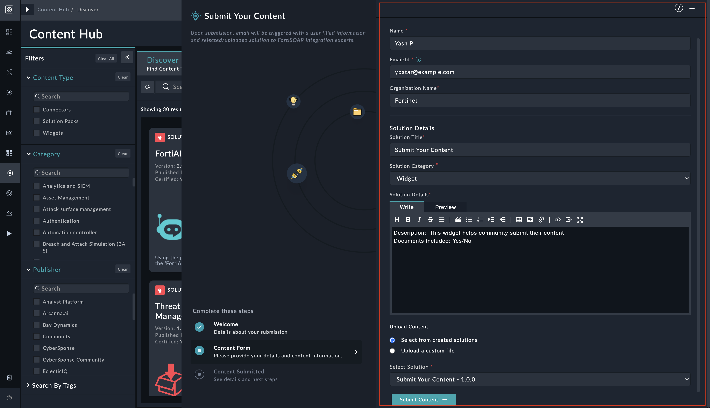

| [Home](../README.md) |
|----------------------|

# Usage

The Community Submissions Widget is a user-friendly interface designed for community members to share their solutions. It offers two primary functionalities:

1. Selection from FSR : Users can select created solutions from the dropdown. The widget provides a convenient way to access and choose from existing solutions available in the FSR.

2. Upload from Device: Alternatively, users have the option to upload solutions directly from their devices. This allows for flexibility and enables users to contribute solutions they have developed locally.

The widget is designed to be intuitive and user-friendly, enabling users to submit solutions with ease.

| [Installation](./setup.md#installation) | [Configuration](./setup.md#configuration) |
|-----------------------------------------|-------------------------------------------|