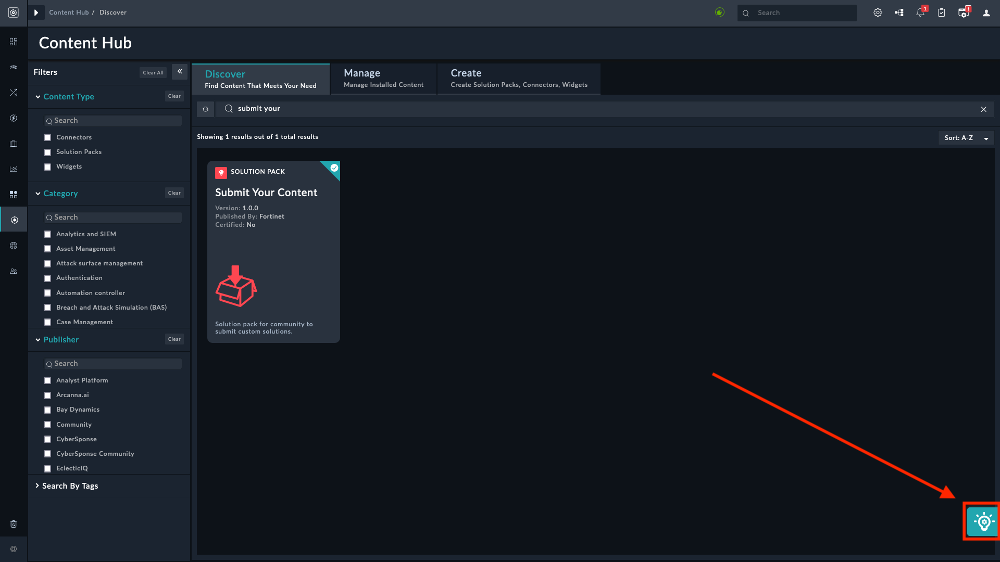
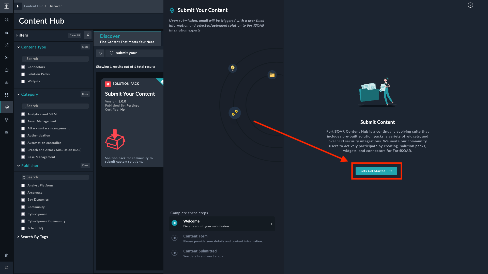
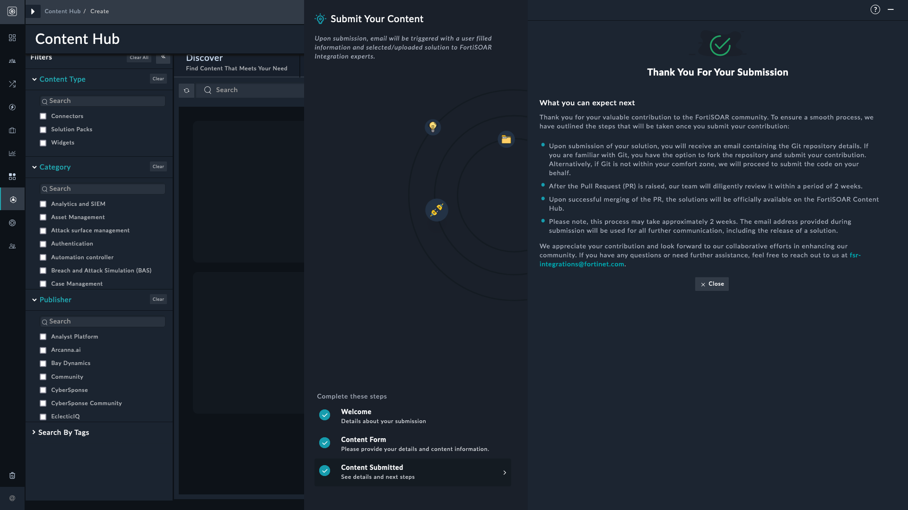

| [Home](../README.md) |
|----------------------|

# Usage

The **Submit Content Form** Widget is a user-friendly interface designed for community members to share their solutions. It is a part of a larger [Submit Your Content](https://github.com/fortinet-fortisoar/solution-pack-submit-your-content) solution pack and cannot be used as a standalone widget. After installation, click the button highlighted in the following screenshot to start using the solution pack and the underlying widget:

These screens are what appear when the solution pack and the underlying widget are in action:

## Welcome

## Content Details Form

## Submitted Content Summary

| [Installation](./setup.md#installation) | [Configuration](./setup.md#configuration) |
|-----------------------------------------|-------------------------------------------|